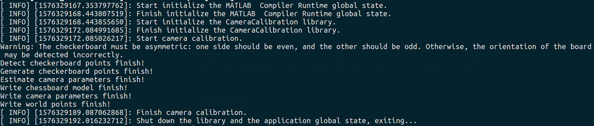
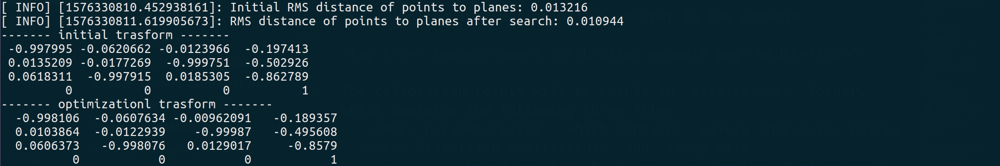
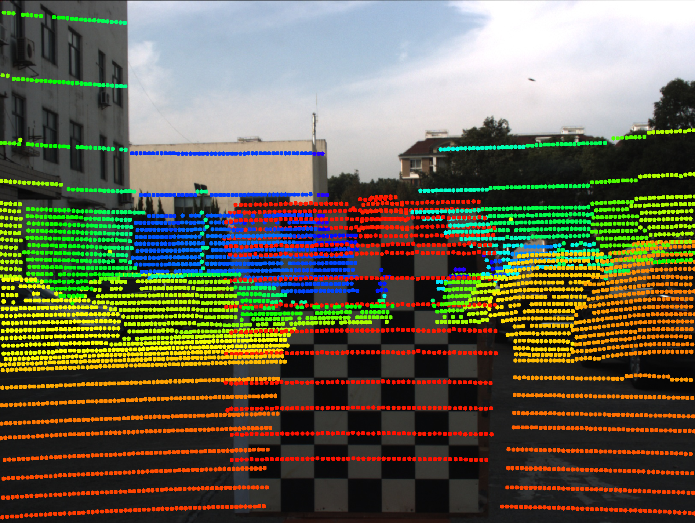

# Lidar camera calibration based on ROS and MATLAB
This package is used to calibrate LiDAR and camera using a chessboard which is commonly used in camera intrinsic calibration. The main idea is inspired by the [Laser-Camera Calibration Toolbox](http://www.cs.cmu.edu/~ranjith/lcct.html) developed by Ranjith. So far, there has the following main features
- [x] Generate calibration data online or from a ROS bag offline ([src/data_generate.cc](src/data_generate.cc))
- [x] Camera calibration using MATLAB or MATLAB runtime ([src/camera_calibration.cc](src/camera_calibration.cc) or [matlab/camera_calibration.m](matlab/camera_calibration.m))
- [x] Chessboard detect for LiDAR point cloud ([src/lidar_chessboard_detector.cc](src/lidar_chessboard_detector.cc))
- [x] Lidar camera calibration based on two-stage optimization ([src/lidar_camera_calibration.cc](src/lidar_camera_calibration.cc))
- [x] Fine-tune calibration results manually ([src/manual_calibration.cc](src/manual_calibration.cc))

## Dependencies
- [ROS] (https://www.ros.org/)(Kinetic or newer)
- [MATLAB 2019b](https://www.mathworks.com/) or [MATLAB Runtime 2019a](https://ww2.mathworks.cn/products/compiler/matlab-runtime.html)

Note that, if you choose to use MATLAB, please refer to [matlab/camera_calibration.m](matlab/camera_calibration.m), or if you choose to use MATLAB Runtime, please refer to [src/camera_calibration.cc](src/camera_calibration.cc). 

## Usage

### Installation
```bash
cd ros_workspace/src
git clone git@github.com:xiaoliangabc/lidar_camera_calibration.git
```

### Build
```bash
cd ros_workspace
catkin_make
source devel/setup.bash
```

### Test Using Example Data

#### Modify config file
Open `param/parameters.yaml` file, change the ros workspace path in `common/data_path` to your own. 

#### Camera Calibration
run 
```
roslaunch lidar_camera_calibration camera_calibration.launch
```
The following information will be output to the console



The calibration result will be write to `data/result/` folder, which contains the following three files
- `camera_parameters.txt`: which contains `camera intrinsics matrix`, `camera distortion coefficients` and `image size`
- `camera_chessboard_model`: which contains chessboard plane model for each image, the format is `index,rotation_x,rotation_y,rotation_z,translation_x,translation_y,translation_z`
- `camera_chessboard_points`: which contains world points coordinate

#### LiDAR Camera Calibration
Run 
```
roslaunch lidar_camera_calibration lidar_camera_calibration.launch
```
The following information will be output to the console



At the same time, calibration result will be shown using opencv



You can enter any character with the keyboard in the active window to close the visualization, then you will see `Whether to save calibration results(y/n):` in console,
- enter `y`: save calibration result to file `data/result/lidar_camera_parameters.txt`
- enter `n`: do not save calibration result 
