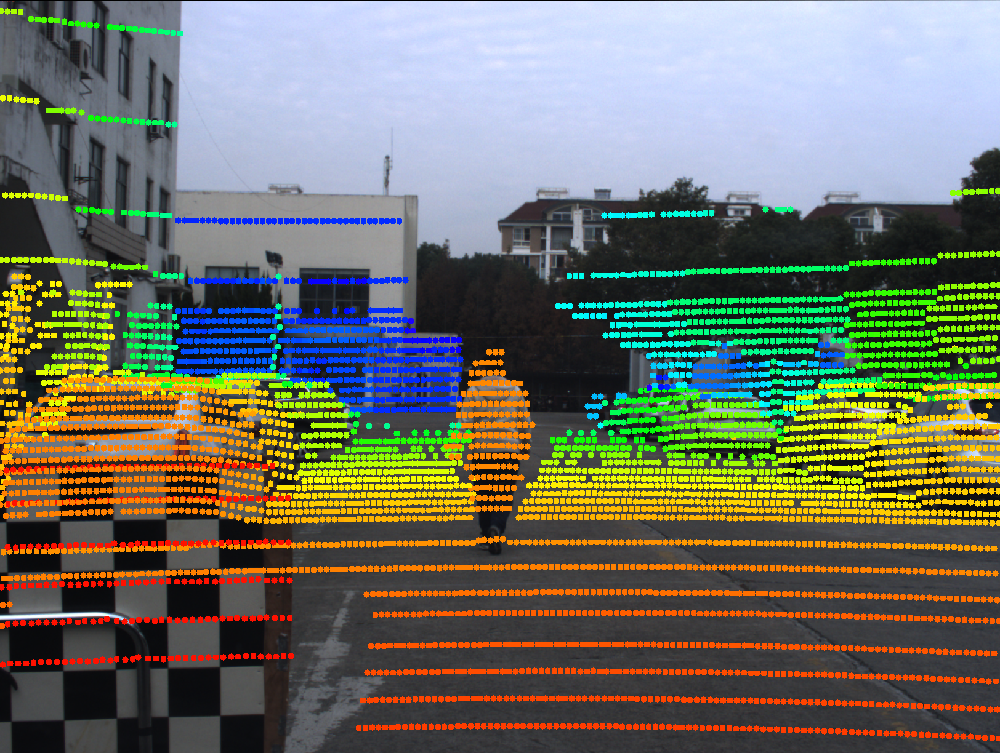
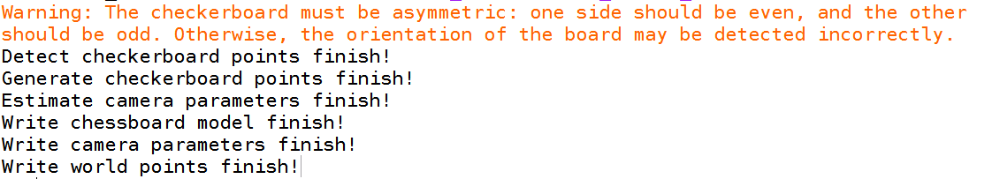
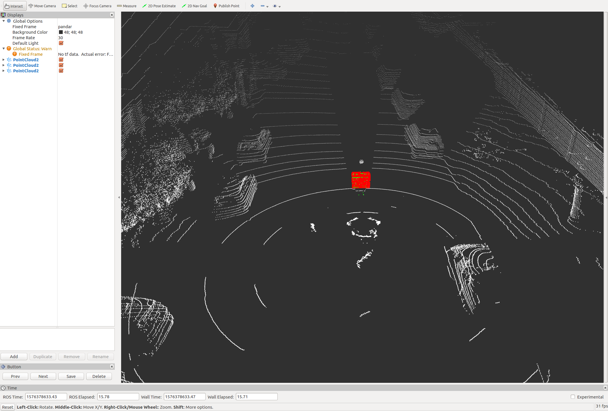
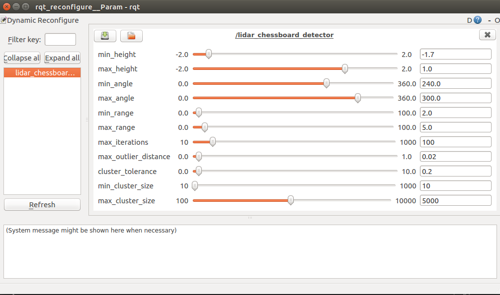
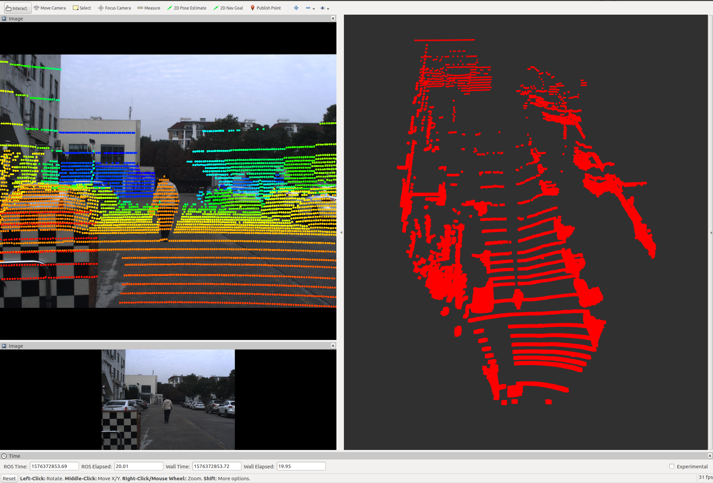
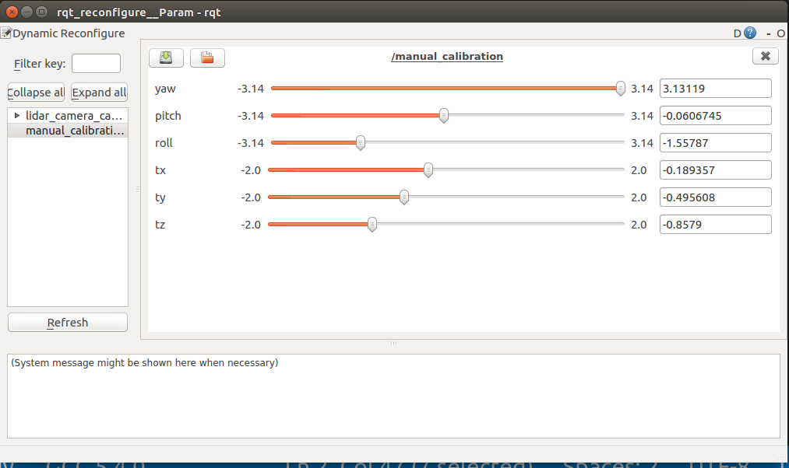
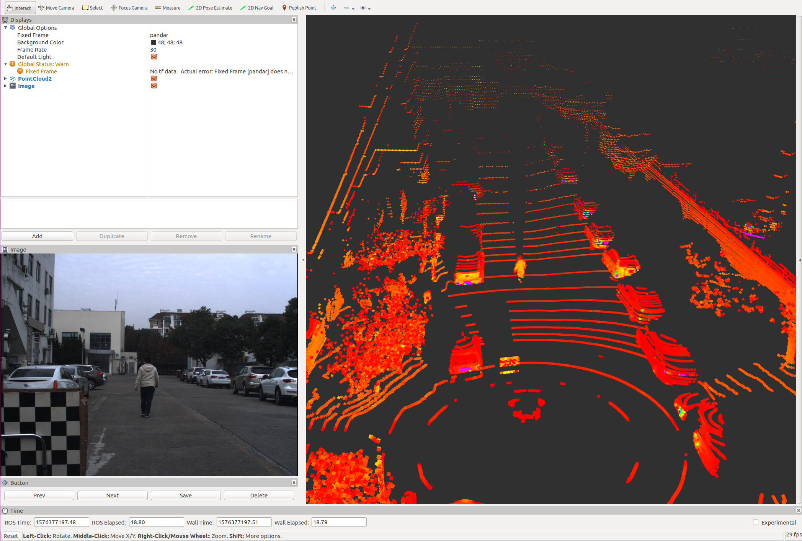

# LiDAR Camera Calibration Based on ROS and MATLAB


This package is used to calibrate LiDAR and camera using a chessboard which is commonly used in camera intrinsic calibration. The main idea is inspired by the [The Laser-Camera Calibration Toolbox](http://www.cs.cmu.edu/~ranjith/lcct.html) developed by Ranjith. So far, there has the following main features
- [x] Generate calibration data online or from a ROS bag offline ([src/data_generate.cc](src/data_generate.cc))
- [x] Camera calibration using MATLAB or MATLAB Runtime 2019a ([matlab/camera_calibration.m](matlab/camera_calibration.m) or [src/camera_calibration.cc](src/camera_calibration.cc))
- [x] Chessboard detect for LiDAR point cloud ([src/lidar_chessboard_detector.cc](src/lidar_chessboard_detector.cc))
- [x] LiDAR camera calibration based on two-stage optimization ([src/lidar_camera_calibration.cc](src/lidar_camera_calibration.cc))
- [x] Fine-tune calibration results manually ([src/manual_calibration.cc](src/manual_calibration.cc))

## Dependencies
- [ROS](https://www.ros.org/)

&ensp;&ensp;&ensp;&ensp;Most procedures are based on ROS, which is commonly use in robotics and self-driving cars. We tested this package on the `Kinetic` version, but we believe that it can be used on other versions as well.

- [MATLAB](https://www.mathworks.com/) or [MATLAB Runtime 2019a](https://ww2.mathworks.cn/products/compiler/matlab-runtime.html)

&ensp;&ensp;&ensp;&ensp;MATLAB is mainly used to do camera intrinsic calibration. Note that, if you choose to use MATLAB, please refer to [matlab/camera_calibration.m](matlab/camera_calibration.m), or if you choose to use MATLAB Runtime 2019a, please refer to [src/camera_calibration.cc](src/camera_calibration.cc)

- A chessboard

&ensp;&ensp;&ensp;&ensp;This is required for intrinsic calibration of the camera as well as extrinsic calibration. The pattern can be downloaded as [eps](http://www.vision.caltech.edu/bouguetj/calib_doc/htmls/pattern.eps) or [pdf](http://www.vision.caltech.edu/bouguetj/calib_doc/htmls/pattern.pdf). The larger the size of the chessboard, the better result usually. It is highly recommended that the chessboard be printed out on plastic or thick poster paper and glued onto a flat board

## Usage

### Installation
```bash
cd ros_workspace/src
git clone git@github.com:xiaoliangabc/lidar_camera_calibration.git
cd ros_workspace
catkin_make
source devel/setup.bash
```

### Calibration Using Example Data

#### Download Example Data
Download example data from [google driver](https://drive.google.com/open?id=1YmB6p4izRCwvrz-fxJGwydhHU0RZfaD6) and unzip it into package folder
```bash
unzip example_data.zip -d ros_workspace/src/lidar_camera_calibration/
rm example_data.zip
```
#### Modify Config File
Open [param/parameters.yaml](param/parameters.yaml) file, change the ros workspace path in `common/data_path` to your own

#### Camera Calibration
##### Calibration Using MATLAB
Open [matlab/camera_calibration.m](matlab/camera_calibration.m) in MATLAB, run
```matlab
camera_calibration('ros_workspace/src/lidar_camera_calibration/data/image', 'ros_workspace/src/lidar_camera_calibration/data/result/', 100)
```
The following information will be output to the console



##### Calibration Using MATLAB Runtime 2019a
run 
```
roslaunch lidar_camera_calibration camera_calibration.launch
```
The following information will be output to the console


##### Calibration result
The camera calibration result will be write to `data/result/` folder, which contains the following three files
- `camera_parameters.txt`: which contains `camera intrinsics matrix`, `camera distortion coefficients` and `image size`
- `camera_chessboard_model.txt`: which contains chessboard plane model for each image, the format is `index,rotation_x,rotation_y,rotation_z,translation_x,translation_y,translation_z`
- `camera_chessboard_points.txt`: which contains the coordinates of each world point


#### Detect Chessboard for LiDAR Point Cloud

Run
```
roslaunch lidar_camera_calibration lidar_chessboard_detector.launch
```
Then `Rviz` and `rqt_reconfigure` will be launched simultaneously, the layout of `Rviz` is look like



Note that
- The white point cloud is the original point cloud collected by LiDAR
- The green point cloud is the candidate point cloud used to detect chessboard
- The red point cloud is the point cloud fall on the chessboard

The layout of `rqt_reconfigure` is look like



There are eleven parameters that can be fine-tuned
- `min_height`: minimum heiht of candidate point cloud data used to detect chessboard (in units of 'meters')
- `max_height`: maximum heiht of candidate point cloud data used to detect chessboard (in units of 'meters')
- `min_angle`: minimum angle of candidate point cloud data used to detect chessboard (in units of 'degree')
- `max_angle`: maximum angle of candidate point cloud data used to detect chessboard (in units of 'degree')
- `min_range`: minimum range of candidate point cloud data used to detect chessboard (in units of 'meters')
- `max_range`: maximum range of candidate point cloud data used to detect chessboard (in units of 'meters')
- `max_iterations`: maximum iterations for RANSAC to fitting chessboard plane
- `max_outlier_distance`: maximum outlier distance for RANSAC to fitting chessboard plane (in units of 'meters')
- `cluster_tolerance`: euclidean cluster tolerance for finding maximum cluster (in units of 'meters')
- `min_cluster_size`: minimum points size to be a cluster in euclidean cluster
- `max_cluster_size`: maximum points size to be a cluster in euclidean cluster

When a chessboard is successfully detected, click the **`Next`** button in `Rviz` to switch to the next frame, repeat until all chessboards have been detected successfully.

The detect results will be writen to `data/result` folder, which contains the following two files
- `lidar_chessboard_model.txt`: which contains chessboard plane model for each point cloud, the format is `index,alpha_x,alpha_y,alpha_z,theta`
- `lidar_chessboard_points.txt`: which contains the coordinates of each point falls on the chessboard , the format is `index,x,y,z`

#### LiDAR Camera Automatic Calibration
Run 
```
roslaunch lidar_camera_calibration lidar_camera_calibration.launch
```
The following information will be output to the console


At the same time, calibration result will be shown using opencv


You can enter any character with the keyboard in the active window to close the visualization, then you will see `Whether to save calibration results(y/n):` in console,
- enter `y`: save calibration result to file `data/result/lidar_camera_parameters.txt`, which contains `euler_angles`, `translation_vector`, `camera intrinsics matrix`, `camera distortion coefficients` and `image size`
- enter `n`: do not save calibration result 

#### LiDAR Camera Manual Calibration
Since the results of automatic calibration may not be very accurate, you may need to manually fine-tune, go straight and run
```
rosbag play -l ros_workspace/src/lidar_camera_calibration/data/lidar_camera_calibration.bag
roslaunch lidar_camera_calibration manual_calibration.launch
```
Then `Rviz` and `rqt_reconfigure` will be launched simultaneously, the layout of `Rviz` is look like



Note that
- The top left image is fusion result, which project point cloud onto image
- The bottom left image is the raw image
- The right window shows the LiDAR point cloud

The layout of `rqt_reconfigure` is look like



There are six parameters that can be fine-tuned
- `yaw`: yaw angle (in units of 'radian')
- `pitch`: pitch angle (in units of 'radian')
- `roll`: roll angle (in units of 'radian')
- `tx`: translation in x axis (in units of 'meters')
- `ty`: translation in y axis (in units of 'meters')
- `ty`:translation in z axis (in units of 'meters')

Once you fine-tune one of these parameters, the fusion result will be shown in `Rviz` immediately. After you finish fine-tuning, the calibration results will be automatically saved in file `data/result/lidar_camera_parameters_manual.txt`, the format is the same as `lidar_camera_parameters.txt`

So far, calibration using example data is over. And now you can do calibration using your own data by referring to the following document

### Calibration Using Your Own Data

#### Modify Config File
Open `param/parameters.yaml` file, change the following parameters
- `common/frame_id`: frame id of your point cloud topic
- `common/point_cloud_topic`: topic name of your point cloud
- `common/image_topic`: topic name of your image
- `common/data_path`: where you want to save your data and result
- `common/square_size`: square size of your chessboard  (in units of 'millimeters')
- `common/min_angle`: minimum angle of point cloud data in the view of image (in units of 'degree')
- `common/max_angle`: maximum angle of point cloud data in the view of image (in units of 'degree')
- `common/min_range`: minimum range of point cloud data you want to use (in units of 'meters')
- `common/max_angle`: maximum range of point cloud data you want to use (in units of 'meters')

#### Generate Calibration Data
**Before generating calibration data, make sure you have launched your LiDAR and camera diver, or play a bag which contains LiDAR and camera topics**

Run
```
roslaunch lidar_camera_calibration data_generate.launch
```
Then `Rviz` will be launched, the layout of `Rviz` is look like



The main procedure is as following
- Place the chessboard (either by holding it very still or by using a mechanical device such as a mounted clamp) at a point visible from both the LiDAR and the camera
- Take a laser scan and an image by clicking the **`Save`** button in `Rviz`, which lies on the bottom left of `Rviz`
- Repeat the two previous processes for different positions of the chessboard to get a feel for the range in position and orientation of the target that will cover the field of view of the camera while ensuring sufficient number of laser returns in each scan

Note that
- There are at least 50 LiDAR points recorded on the chessboard plane
- The corners of the chessboard pattern must be clearly discernible in the image
- Take not less than 20 cloud-image pairs for varying valid positions and orientations of chessboard target

After generating calibration data successfully, you can see LiDAR data in folder `common/data_path/cloud` named as `00**.pcd` and image data in floder `common/data_path/image` named as `00**.jpg`

#### Camera Calibration
This is the same as [Camera Calibration](#Camera-Calibration) in [Calibration Using Example Data](#Calibration-Using-Example-Data)

#### Detect Chessboard for LiDAR Point Cloud
This is the same as [Detect Chessboard for LiDAR Point Cloud](#Detect-Chessboard-for-LiDAR-Point-Cloud) in [Calibration Using Example Data](#Calibration-Using-Example-Data)

#### LiDAR Camera Automatic Calibration
This is the same as [LiDAR Camera Automatic Calibration](#LiDAR-Camera-Automatic-Calibration) in [Calibration Using Example Data](#Calibration-Using-Example-Data)

#### LiDAR Camera Manual Calibration
This is the same as [LiDAR Camera Manual Calibration](#LiDAR-Camera-Manual-Calibration) in [Calibration Using Example Data](#Calibration-Using-Example-Data)

## Reference
[The Laser-Camera Calibration Toolbox](http://www.cs.cmu.edu/~ranjith/lcct.html)

[Laser-Camera-Calibration-Toolbox](https://github.com/zhixy/Laser-Camera-Calibration-Toolbox)